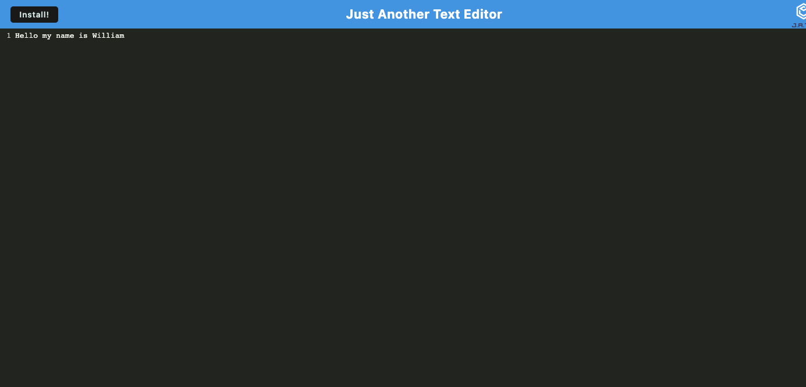
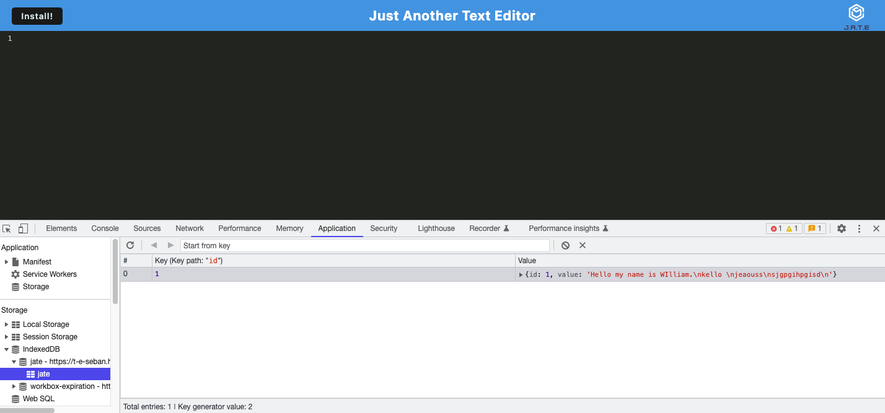

# Text-Editor

## Deployed Link:
https://t-e-seban.herokuapp.com/


 



## Usage
To use the deployed text editor, the user merely has to click on the link above and start typing their notes that they would like saved within the indexedDB on their local device.  The user should click the install button to gain the access of running the text editor offline.

## Technologies Used
- Webpack - A module bundler with a primary purpose is bundling Javascript for usage in a browser.
- Webpack Service Worker - Javascript assets that act as proxies between the browser and server
- Webpack PWA Manifest - JSON file tha tells an app how to behave when downloaded on a local device and disconnected from the web.
- Babel - Javascript compiler that "translates" modern versions of javascript into versions that every browser can read.
- Node.js - An asynchronous event-driven program to run Javascript.
- JavaScript - Allows developer to make static webpages dynamic and interactive.  For this exercise it was used to alter the original webpage to change the questions, change the answers, add a dynamic timer/countdown(that also ends the game), as well as, allow saving of scores.
- Git - Git is what I used to work on my personal computer and pushing my work to GitHub.
- GitHub - A cloud based repository that holds my saved code reserved for resetting my personal computer deployment.

## Description

The purpose of this project was to utilize our skills with PWAs; set up webpack and service workers to ensure that our server was rendering our client side application.  We also had to ensure our PWA manifest was utilized correctly to ensure our app was downloadable.

## Installation

If using deployed link or downloaded installation not necessary. 

## Lessons Learned
The most effective lessons learned for me were...
1. Webpack.  
2. Conceptual understanding of multi-levelled package.json.


## Code Snippets
JavaScript
```javaScript
 new WebpackPwaManifest({
        name: 'Text Editor',
        short_name: 'T.E.',
        fingerprints: false,
        inject: true,
        description: 'Edit Text',
        background_color: '#7eb4e2',
        theme_color: '#7eb4e2',
        start_url: '/',
        publicPath: '/',
        icons: [
          {
            src: path.resolve('src/images/logo.png'),
            sizes: [96, 128, 192, 256, 384, 512],
            destination: path.join('assets', 'icons'),
          },
          ],
      }),
```
```JavaScript
module: {
      rules: [
        {
          test: /\.css$/i,
          use: ['style-loader', 'css-loader'],
        },
        {
          test: /\.m?js$/,
          exclude: /node_modules/,
          use: {
            loader: 'babel-loader',
            options: {
              presets: ['@babel/preset-env'],
              plugins: ['@babel/plugin-proposal-object-rest-spread', '@babel/transform-runtime'],
            },
          },
          },
      ],
    },
```

## Credits

NA

## License
Please refer to the LICENSE in the Repo.